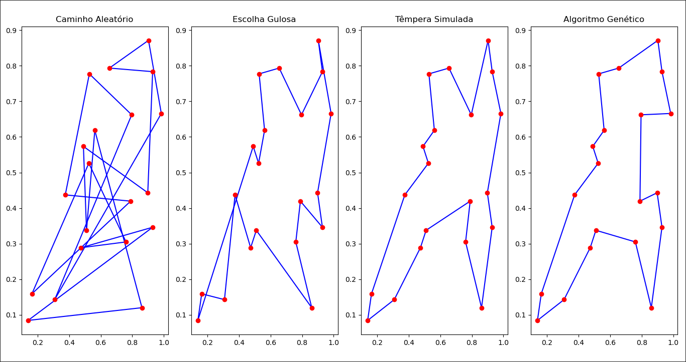

<h1 align="center">Problema do Caixeiro Viajante</h1>

Este projeto implementa e compara três heurísticas para resolver o clássico **Problema do Caixeiro Viajante (PCV)**:

- **Algoritmo Genético (AG)**  
- **Têmpera Simulada (TS)**  
- **Escolha Gulosa (EG)**  

Ele também contém o artigo em PDF explicando a fundamentação teórica, metodologia e resultados obtidos.

---

##  Descrição do Problema
O **PCV** consiste em encontrar o caminho de menor custo (ou distância) que permita a um caixeiro visitar todas as cidades de um conjunto exatamente uma vez e retornar à cidade de origem.
<br>
Trata-se de um problema **NP-difícil**, cuja complexidade cresce fatorialmente com o número de cidades.

---

##  Algoritmos Implementados

### Algoritmo Genético (`AlgoritmoGenetico.py`)
- Baseado em **seleção, crossover e mutação**.  
- Usa elitismo para manter a melhor rota a cada geração.  
- Parâmetros configuráveis:  
  - Tamanho da população (padrão: 100)  
  - Número de gerações (padrão: 1000)  
  - Taxa de mutação (padrão: 0.2)  

### Têmpera Simulada (`TemperaSimulada.py`)
- Inspira-se no processo de resfriamento de metais.  
- Aceita soluções piores de forma probabilística para escapar de mínimos locais.  
- Parâmetros configuráveis:  
  - Temperatura inicial (padrão: 30)  
  - Fator de resfriamento (padrão: 0.99)  

### Escolha Gulosa (`EscolhaGulosa.py`)
- Estratégia simples que escolhe sempre a cidade mais próxima como próximo passo.  
- Serve como **baseline** para comparação.

### Representação de Cidades (`Coordenada.py`)
- Cada cidade é representada por uma coordenada `(x, y)`.  
- Funções para calcular distâncias entre duas cidades e o custo total de uma rota.

---

## Visualização
O arquivo `main.py`:
- Gera cidades aleatórias.  
- Executa os três algoritmos e compara seus resultados.  
- Plota:  
  - **Evolução do custo por iteração**  
 
  - **Caminhos finais encontrados por cada algoritmo**  
 

---

##  Como Executar

### 1. Clonar o repositório
```bash
git clone https://github.com/EstefanesGabriel/caixeiro-viajante.git
cd caixeiro-viajante
```

### 2. Instalar dependências
```bash
pip install numpy matplotlib
```

### 3. Executar
```bash
python main.py
```

---

## Referência
O artigo desenvolvido como parte deste projeto está disponível no repositório, sendo o arquivo `artigo.pdf`.

### Autores
- **Alexandre Alberto Menon** – Desenvolvimento, algoritmos, documentação.
- **Gabriel Rodrigues Estefanes** – Desenvolvimento, algoritmos, documentação.
